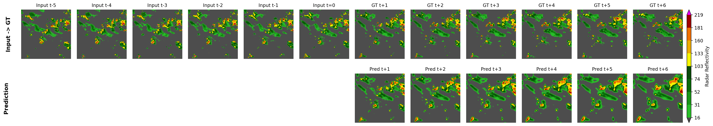

# YanTian Spatiotemporal Sequence Model

This project builds a general temporal extrapolation prediction framework, focusing on forecasting future states from continuous frame-based time series data (input: historical multi-frame sequences → output: future multi-frame sequences).

Using **SEVIR precipitation nowcasting** as a standard benchmark task, the framework is comprehensively validated. It provides a unified and plug-and-play architecture that can be easily extended to various spatiotemporal sequence tasks such as radar echo prediction, meteorological variable forecasting, video prediction, and temporal image modeling.

The framework integrates **ONNX Runtime** for accelerated inference, supporting efficient deployment on both CPU and GPU, making it suitable for both research experiments and real-world applications.

---

## 📋 Table of Contents

* [Project Overview](#project-overview)
* [Directory Structure](#directory-structure)
* [Installation and Setup](#installation-and-setup)
* [Data Preparation](#data-preparation)
* [Usage](#usage)
* [Core File Description](#core-file-description)

---

## Project Overview

This project implements a general temporal extrapolation framework, mainly applied to precipitation nowcasting. It predicts future 12 frames based on 13 historical frames of precipitation fields.

* **Dual-mode support**: Compatible with both the SEVIR benchmark dataset and custom application data
* SEVIR mode provides visualization of prediction results, while custom mode outputs raw prediction data (NumPy format)
* The model is based on SwinLSTM (Tang et al., ICCV, 2023)

---

## Directory Structure

```
Development_YanTian_nowcasting/
├── predict_results/              # SEVIR prediction visualization images
│   └── *.png
├── predict_results_general/      # General prediction results (NumPy format)
│   └── *.npy
├── sevir_dataset/                # SEVIR dataset directory
│   ├── CATALOG.csv              # Metadata
│   ├── train.txt                # Training set list
│   ├── val.txt                  # Validation set list
│   ├── test.txt                 # Test set list
│   └── cascast/                 # Processed data
│       └── test/                # Test set (.npz files)
├── make_sevir_dataset.py        # Data preprocessing script
├── inference_sevir.py           # SEVIR inference script
├── inference_general.py         # General inference script
├── README.md                    # Documentation
└── environment.txt              # Python dependencies
```

---

## Installation and Setup

### Environment Setup

```bash
# Create conda environment
conda create -n nowcasting_test python=3.10
conda activate nowcasting_test
pip install -r environment.txt
```

---

## Data Preparation

### Input Format

| Mode   | Time Dimension | Spatial Dimension | Channels | Normalization  |
| ------ | -------------- | ----------------- | -------- | -------------- |
| SEVIR  | 13 frames      | 384×384           | 1 (VIL)  | 0–1 (internal) |
| Custom | Arbitrary      | Arbitrary         | 1        | 0–255 (input)  |

### Output Format

| Mode   | Time Dimension | Spatial Dimension | Storage Format      |
| ------ | -------------- | ----------------- | ------------------- |
| SEVIR  | 12 frames      | 384×384           | PNG (visualization) |
| Custom | 12 frames      | Original size     | `.npy` (raw data)   |

---

### SEVIR Standard Dataset

1. Download SEVIR raw H5 data into `./sevir_dataset/data/`:

```bash
# Download SEVIR dataset
aws s3 sync s3://sevir ./sevir_dataset/ --no-sign-request
```

2. Run preprocessing script:

```bash
python make_sevir_dataset.py
```

3. Processed data will be saved as `.npz` files in:

```
./sevir_dataset/cascast/
```

---

### Custom Data

Custom data does **not** need to match SEVIR scales and supports arbitrary spatiotemporal resolutions.

#### Requirements

* **Data type**: NumPy array
* **Value range**: 0–255 (radar reflectivity)
* **Shape format**: `(T, H, W)`

  * If `T < 13`: pad with zeros in the front
  * If `T > 13`: keep the most recent 13 frames
  * Spatial dimensions: resized to 384×384 using bilinear interpolation

---

## Usage

### Download model and dataset

baidu link for model: https://pan.baidu.com/s/17XIQebH4TlvpS3H6P0DSUA?pwd=f6dw password: f6dw
baidu link for sevir_dataset: https://pan.baidu.com/s/1G0p0wLwlvdBwv-f4jw2hbg?pwd=nve3 password: nve3
### Mode 1: SEVIR Inference

```bash
# Step 1: Preprocess data
python make_sevir_dataset.py

# Step 2: Run inference
python inference_sevir.py
```

**Output**:

* Location: `./predict_results/`
* Format: PNG images (visualized forecasts)

---

### Mode 2: Custom Data Inference

```bash
python inference_general.py
```

**Output**:

* Location: `./predict_results_general/`
* Format: `.npy` files (raw prediction data)

---

## Core File Description

### make_sevir_dataset.py

Preprocessing script that converts SEVIR raw H5 data into a model-compatible format.

**Main Functions**:

* Reads H5 files and `CATALOG.csv` metadata
* Processes samples based on dataset splits
* Saves data in `.npz` format

---

### inference_sevir.py

Inference script for SEVIR data with visualization support.

**Main Functions**:

* Loads ONNX model
* Reads preprocessed `.npz` data
* Generates PNG visualization outputs

---

### inference_general.py

General inference script supporting arbitrary input sizes.

**Main Functions**:

* Automatic preprocessing (temporal + spatial dimensions)
* ONNX inference
* Automatic postprocessing (restore original resolution)
* Saves results in `.npy` format

**Trained by: Qi Liu et al., Institute of Atmospheric Physics, Chinese Academy of Sciences (IAP/CAS), Research Unit of Machine Learning Application (RUMLA).**


# YanTian 时空序列模型

构建通用时序外推预测框架，专注解决连续帧时序数据的未来状态推演任务（输入历史多帧序列 → 预测未来多帧序列）。

以 SEVIR 降水临近预报 为标准示范任务，完整验证框架有效性；
提供统一、可插拔的架构设计，可快速迁移至雷达回波、气象要素、视频预测、时序图像等各类时空序列任务；
集成 ONNX Runtime 加速推理，支持 CPU/GPU 高效部署，兼顾科研实验与业务落地。

## 📋 目录

- [项目简介](#项目简介)
- [目录结构](#目录结构)
- [安装与运行](#安装与运行)
- [数据准备](#数据准备)
- [使用方法](#使用方法)
- [核心文件说明](#核心文件说明)

---

## 项目简介

本项目实现了 YanTian 时序外推预测框架，主要用于降水临近预报（Nowcasting），基于历史 13 帧 → 预测未来 12 帧的降水场。
- **双模式支持**：支持 SEVIR 标准数据集和自定义业务数据。
- SEVIR 模式提供预报结果可视化，自定义模式提供原始预报数据保存（Numpy 格式）
- 模型参考 SwinLSTM (Tang et al., ICCV, 2023)


## 目录结构

```
Development_YanTian_nowcasting/
├── predict_results/              # SEVIR 预测结果可视化图片
│   └── *.png
├── predict_results_general/      # 通用数据预测结果 (Numpy 格式)
│   └── *.npy
├── sevir_dataset/                # SEVIR 数据集目录
│   ├── CATALOG.csv              # 数据元信息
│   ├── train.txt                # 训练集列表
│   ├── val.txt                  # 验证集列表
│   ├── test.txt                 # 测试集列表
│   └── cascast/                 # 处理后的数据
│       └── test/                # 测试集 npz 文件
├── make_sevir_dataset.py        # 数据预处理脚本
├── inference_sevir.py           # SEVIR 数据推理脚本
├── inference_general.py         # 通用数据推理脚本
├── README.md                    # 项目说明文档
└── environment.txt              # Python 依赖环境
```

---

## 安装与运行

### 下载模型
百度网盘模型链接: https://pan.baidu.com/s/17XIQebH4TlvpS3H6P0DSUA?pwd=f6dw 提取码: f6dw
数据集链接: https://pan.baidu.com/s/1G0p0wLwlvdBwv-f4jw2hbg?pwd=nve3 提取码: nve3

### 环境准备

```bash
# 创建 conda 环境
conda create -n nowcasting_test python=3.10
conda activate nowcasting_test
pip install -r environment.txt
```

## 数据准备

### 输入格式

| 模式 | 时间维度 | 空间维度 | 通道数 | 归一化 |
|------|---------|---------|--------|--------|
| SEVIR | 13 帧 | 384×384 | 1 (VIL) | 0~1 (内部) |
| 自定义 | 任意帧 | 任意尺寸 | 1 | 0~255 (输入) |

### 输出格式

| 模式 | 时间维度 | 空间维度 | 保存格式 |
|------|---------|---------|---------|
| SEVIR | 12 帧 | 384×384 | PNG (可视化) |
| 自定义 | 12 帧 | 原始尺寸 | `.npy` (原始数据) |

### SEVIR 标准数据集

1. 下载 SEVIR 原始 H5 数据到 `./sevir_dataset/data/`

```bash
# 下载 SEVIR 原始数据到 ./sevir_dataset/
aws s3 sync s3://sevir ./sevir_dataset/ --no-sign-request
```

2. SEVIR 数据预处理脚本：

```bash
python make_sevir_dataset.py
```

3. SEVIR 数据将被处理为 `.npz` 格式并保存到 `./sevir_dataset/cascast/`

### 自定义业务数据

自定义数据**不需要**与 SEVIR 数据同尺度，支持任意时空尺度：

#### 数据要求
- **数据类型**: NumPy 数组
- **值域范围**: 0~255 (雷达回波反射率)
- **维度格式**: `(T, H, W)` - 其中 T 为帧数, H, W 为空间分辨率.(以下操作代码会自动处理)
    - 对于 T 少于 13 帧: 前面填充 0；多于 13 帧: 截取最近的 13 帧
    - 空间维度 : 使用双线性插值缩放到 384×384 

---

## 使用方法

### 模式 1: SEVIR 数据推理

```bash
# 1. 数据预处理
python make_sevir_dataset.py

# 2. 执行推理
python inference_sevir.py
```

**输出**: 
- 位置: `./predict_results/`
- 格式: PNG 图片（可视化预报结果）

### 模式 2: 自定义数据推理

```bash
python inference_general.py
```

**输出**: 
- 位置: `./predict_results_general/`
- 格式: `.npy` 文件（原始预报数据）


## 核心文件说明

### [make_sevir_dataset.py](make_sevir_dataset.py)
数据预处理脚本，将 SEVIR 原始 H5 数据转换为模型可用的格式。

**主要功能**:
- 读取 H5 文件和 CATALOG.csv 元信息
- 按样本列表切片处理
- 保存为 `.npz` 格式

### [inference_sevir.py](inference_sevir.py)
SEVIR 数据推理脚本，提供可视化输出。

**主要功能**:
- 加载 ONNX 模型
- 读取预处理的 `.npz` 数据
- 生成可视化 PNG 图片

### [inference_general.py](inference_general.py)
通用数据推理脚本，支持任意尺寸数据。

**主要功能**:
- 自动预处理 (时间+空间维度)
- ONNX 推理
- 自动后处理 (还原原始尺寸)
- 保存 `.npy` 格式结果

**模型训练：刘祺等，中国科学院大气物理研究所（IAP/CAS），RUMLA。**


